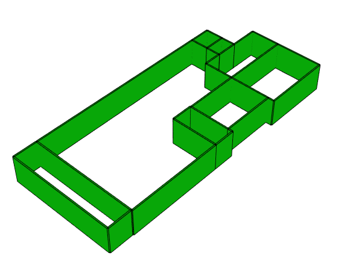

# TXT to IFC

This project convert TXT files with 2D coordinates into BIM modells in IFC format with the usage of the Revit API in C#.
The same was also tried using the xBIM Toolkit and the IfcOpenShell libray, but it seems not to be possible to add family entities with these libraries.
 
### Prerequisites

To use this program you need to have:

1. A compiler; Visual Studio 2019 is recommended.

2. Have installed .NETFramework, Version=v4.7

3. Have installed the next NuGet -Pakages:
- Xbim.Essentials : 12 KB  
- Xbim.Geometry : 13 KB

For more information about xBIM go to this [link] (http://docs.xbim.net).

4. In case of use of the IfcOpenShell code you need to have python installed, and the  IfcOpenShell  pakage.
you can installed with conda with the next code:
```conda install -c conda-forge -c oce -c dlr-sc -c ifcopenshell ifcopenshell```

For more information about  IfcOpenShell go to this [link] (http://ifcopenshell.org/index.html).

## Running the tests
 
The next is a section of the original content of a sample txt file.
```
X1	        Y1	X2	        Y2      TYPE	DUMP	DUMP
34.6666666667	314	34.6666666667	347	door	1	1	
116.222222222	69	116.222222222	126	door	1	1	
169.666666667	59	169.666666667	89	door	1	1	
169.666666667	9	169.666666667	53	door	1	1
```

 The next image shows the result of the code in base of the sample txt file  and using the xBIM toolkit [code](https://gitlab.lrz.de/ga95nub/textmodels/blob/master/xBIM%20code/Program.cs):


<p align="center">
	  
</p>


