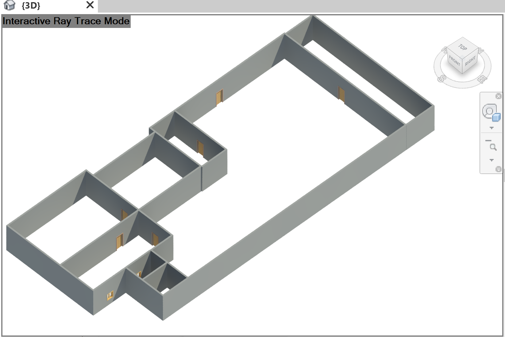

# TXT to IFC

This project converts TXT files with 2D coordinates into BIM models in IFC format with the usage of the Revit API in C#.
The same was also tried using the xBIM Toolkit and the IfcOpenShell library, but it seems not to be possible to add family entities with these libraries.
 
## Prerequisites

To use this program you need to have:

1. Revit installed, this code was made in Revit 2019.

## Running the tests
 
The next is a section of the original content of a [sample .txt file](https://gitlab.lrz.de/ga95nub/textmodels/blob/master/00.SampleData/0003_sample_floor_with_Windows.txt).
```
X1	        Y1	X2	        Y2      TYPE	DUMP	DUMP
34.6666666667	314	34.6666666667	347	door	1	1	
116.222222222	69	116.222222222	126	door	1	1	
169.666666667	59	169.666666667	89	window	1	1	
169.666666667	9	169.666666667	53	window	1	1

```

 The next image shows the result of the code using the sample .txt file as an input.
 and using the Revit API [code](https://gitlab.lrz.de/ga95nub/textmodels/blob/master/03.RevitAPI/ThisDocument.cs):

<p align="center">
	  
</p>


To use the code, open Revit, go to Manage -> Macros -> Create a module with the name "TestModule" -> 
Create a Macro with the name "Main" -> Click in "Edit" macro and copy paste the code from the file
 [ThisDocument.cs](https://gitlab.lrz.de/ga95nub/textmodels/blob/master/03.RevitAPI/ThisDocument.cs)
, also add a new file and copy paste the [ReadTxt.cs](https://gitlab.lrz.de/ga95nub/textmodels/blob/master/03.RevitAPI/ReadTxt.cs) code.
Build the code and then run the macro form Revit.

It should display the same result if the same families are also loaded to the file, otherwise the name of the families has to be changed in the code.
The family names used are in [this section](https://gitlab.lrz.de/ga95nub/textmodels/blob/master/03.RevitAPI/ThisDocument.cs#L59-65) of the code.

